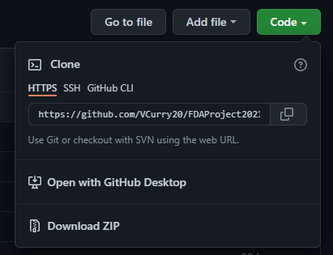

# Fundamentals2021
Project for Fundamentals of Data Analysis

Completed: December 2021

 

## CAO Point Review and Plotting

 

***

## Overview

***

 - Repository 
   - README.md
   - requirements.txt

- Pyplot Notebook
  - Overview of Matplotlib.pyplot
  - In-depth explainating of three interesting plots from Matplotlib.pyplot

- COA Points Notebook
  - Overview of loading points from CAO Website to Pandas Dataframe
  - Detailed comparison of CAO points from 2019, 2020 & 2021 using Pandas functionality
  - Plots and visualisations 

 

***
## Repository Contents

[1]

This repository includes:

- pyplot overview - jupyter notebook

- CAO review - jupyter notebook

- requirements.txt 

- Brief Folder

- Image Folder

- Data Folder

- README.md

- gitignore

 

***

## Purpose of this Repository

The overall purpose of this notebook is two fold, the first is to explore the purpose and use of Matplotlib-pyplot, the second is to upload, clean and use the data from the CAO points for three years.

In this repository you will find two differnt Jupyter notebooks, which have been used to document the process of each of these aims.

In the first Jupyter notebook I have reviewed Matplotlib and the use of Matplotlib plotting, concentrating on 3 main plots and their advantanges and disadvantages.

I had also included the brief for this project for review in a seperate folder.

In the second Jupyter notebook, I have downloaded and worked on the CAO points for 2021, 2020 and 2019.

These files are in three different forms - HTML, Excel and a PDF.

I have used Pandas to create a dataframe of these yearly points - these included level 6, 7, & 8 points.

Cleaning this data and ensuring that all of this data is ready to work on takes up a large portion of the CAO Jupyter notebook.

 

### Python - Anaconda Installation

To complete this Repository I used Python, specifically Anaconda. Installing this allows you to use Python directly, with a code editor or with Jupyter Notebook.

This project was completed with a mix of both, Visual Studio Code, a code editor and also Jupyter Notebooks, which were launched using command line, with the Notebook opening in an internet browser (this will open in your default browser).

> To install and use Python you can download it directly [here](https://www.anaconda.com/products/individual)

You can install this on your Windows, Mac or Linux OS.

[2]

 

### Additional Requirements

(Please note that these specifications are for Windows and may differ for the other OS)

It is also recommended that you should install the following alongside Anaconda.

> [Visual Studio Code](https://code.visualstudio.com/) - This is a code editor and will allow you to create and view the code. 

> [CMDR](https://cmder.net/) - which will allow you to access the terminal on your computer - you can use this as an alternative command line. Through this you can push commands to run the code on your device.

> [Git](https://git-scm.com/) - Which will allow you to connect with Guthub and Fork this respository

>[Github.com](https://github.com/) - this is where the repository is stored and from here you can acccess the repository. You can fork a copy of the respository to your Github account.

[3][4][5][6]

 

### Accessing Git Hub

When you have installed Anaconda and the additional required programs you can then fork or clone the github Repository - this allows you to take a copy of this repository and save it to your computer where you can interact with the code - running it, changing it, and testing different parts of it. 

None of these actions will change the original repository.

You will find this fork symbol on the top right of the repository. From here you can make a copy of the repository - this saves to your own GitHub account. 

Now you have a copy of the repository to review on Github.

You can also star the repository allowing you to save the repository to come back to.

Using the clone method you can save a copy of the repository to your own device. 

Open CMDR :

Using commands `cd ` navigate to the folder you want to save the file.

Once in the file location use the following commands:

`git clone` plus the HTTPS address

You will now have a copy of the repository on your computer.

[7][8][9]

 

### Libraries Used

For this project I have used the following librares within Python:

-  `NumPy`, which is numerical python

-  `Pandas`, which allows us to create dataframes and is a step up from the numerical capablities of `NumPy`

- `Matplotlib`, which I review and use for plotting

- `Seaborn`, which is built on `Matplotlib` and expands on its capabilities

- `Scipy`, which allows for use to analyise data

- `requests`, a HTTP library for Python

 

***

If you do not either have the space on your device for this full Python download Install or are perhaps reviewing this Repository as a starting point for Python and Jupyter Notebooks, I have also included below the details to access the notebooks without downloading Anaconda.

***
 

## Jupyter Notebooks

This project is completed using two [Jupyter Notebooks](https://jupyter.org/).

Jupyter can be launched via CMDR and works through your browser. This is an open source notebook that allows you to run your code, testing it, changing it and viewing the outputs in one place.

It is visually clean, and allows for the users to view the code and outputs clearly.

Navigate in your CMDR to the file you would like to save your notebook and type either Jupyter Notebook or Jupyter Lab.

These will launch a notebook via your browser - you can then create a new file - choosing the Python 3 option. This is an interactive Python page which allows you to run and save code.

This is now an interactive Jupyter Notebook.

When you are finished within the notebook you can use `CTRL S` - saving the file, and close the browser.

Then in CDMR use `CTRL C` to close the notebook browser which will continue to run in the background.

Jupyter Notebooks are comprised of cells, in each cell there will be either code or markdown text (text outling the project /code). To click down through each cell, which also action each cell click `Shift` & `Enter`.

You will also find a range of options along the top of the notebook which provide additional funactionality (note there is slight differences between Jupyter notebook and lab).

By choosing `Kernal - Restart & Run All`, will clear all outputs and rerun the entire notebook.

When you view the notebook using this method you will be able to make changes to the code, change outputs and save this new version.

For additional information on Jupyter Notebooks please review [here.](https://www.dataquest.io/blog/jupyter-notebook-tutorial/)

[10][11]

### Viewing & Running Notebooks
 

As outlined above if you do not want to install Anaconda you can run the notebook in both an online viewer and also in Binder which will allow you to interact with the code without changing the original notebook.

 

NBViewer offers a static overview of the notebook - here you can view the code but there is no ability to interact with the code or run the code.

[12]

 

Binder offers users the choice to interact with the code without needing any installation of programs to your device. You can change the code - run the code - amend the code. None of this will be saved and allows you the opportunity to test with no reprocussions.

When accessing the notebooks using binder you can use the same commands to work through the cells as those used directly in a Jupyter Notebook.

This is a link to the overall project:

[13]

 

### Action Binder Notebook

When the notebook opens you will that the files within the repository are listed along the left handside:

The .ipynb are the Jupyter notebooks - click on these files to open the notebook:

- action the cells by clicking 'SHIFT' and 'ENTER'

- click into the cells to change the code

All outputs of code will appear underneath the cells the code is written into.

Also you can download the code from page to your device.

None of the tests you run on this Binder link will save to or amend the original repository.

 

## Acknowledgements

I would like to acknowledge that for the CAO notebook in particular this was completed following the lectures by Dr Ian McLoughlin, as part of the Fundamentals of Data Analysis Module for the GMIT HDip in Computing, in Data Analysis.

 

***
References:
***

[1] Calisphere, University of Southern California. Libraries, 80 year old Clerk, (2021) https://calisphere.org/item/153c3fdf7f9356342280fd417e102e95/ 

[2] Anaconda, Individual Edition, (2021) https://www.anaconda.com/products/individual 

[3] Visual Studio Code, main page, (2021) https://code.visualstudio.com/ 

[4] Cmder, main page, (2021) https://cmder.net/ 

[5] Git, main page, (2021) https://git-scm.com/ 

[6] Github, github main page, (2021), https://github.com/ 

[7] Fork Image, https://mrpg.scene7.com/is/image/MRP/02_5301010633_SI_00?$preset$&wid=767 

[8] Fork Image from git hub repository -screen snip https://github.com/VCurry20/FDAProject2021/blob/main/Images/FrkGitHub.PNG

[9] Clone Snip, https://github.com/VCurry20/FDAProject2021/blob/main/Images/Clone_FDA.PNG 

[10] Jupyter, Main page, (2021) https://jupyter.org/ 

[11] Data Quest, How to use Jupyter Notebook in 2020: A beginner’s tutorial, (24th Aug, 2020) https://www.dataquest.io/blog/jupyter-notebook-tutorial/ 

[12] nbviewer, main page, (2021) https://nbviewer.org/ 

[13] binder, main page, (2021) https://mybinder.org/ 
